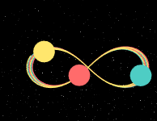
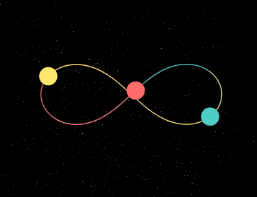
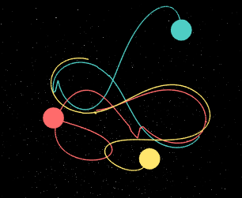
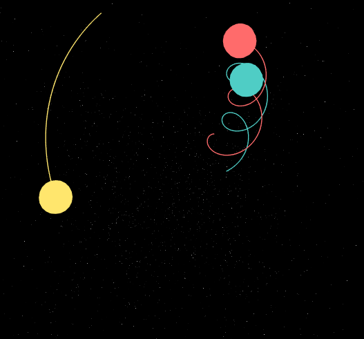
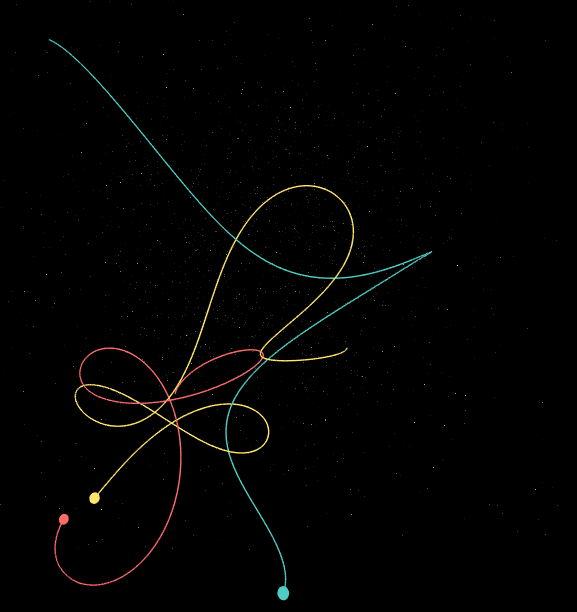

[click me to preview this App](https://yo1995.github.io/Daily_Web_Tasks/threebody)

## Description

> **Trisolarans, may the force be with you**

According to the novel *The Three-Body Problem* written by Liu, one of the major problems that besets the civilians on the colonized planet is that there exists 3 stars in their star-system. Proposed by David Hilbert in 1900s, the n-bodies problem is always a spectre that haunted human beings for decades. People finally acknowledged that the three-body problem inevitably leads to chaotic outcome. Therefore, the ultimate fate that confronts the Trisolarans is perpetual perishment.

In order to help their worships, the ETO began to try to figure out analytical solutions with great efforts. They tried so hard to solve a theoretically insoluble problem. Therefore, it could only lead to desperation and suspicion.

The author glued snippets of code together to memorize the bygone history of one of the parallel universes. Always keep in mind - 

> **WE ARE ALL BUGS**

## Versions

### 201807

- added first version. YEEEHAAALL!!!

## Usage

0. check your web browser performance. generally works fine on Safari, Chrome, Firefox. does not support Edge and IE.

1. open the link and watch. by default a random tri-star system will be generated on the canvas of universe.

2. use the sliders and buttons to adjust settings.

3. toggles to switch star trails. rocket to copy the parameters of current universe. (copied link need some jimmy to work ;-)

4. click presets to enable specific bestowed n-body systems. discover more with your own settings!

## Development

0. install React App environment 

1. npm start from root dir to preview

2. npm build to obtain publish-version

note there is a specific path setting in App.js, remove or modify before deploy.

## MATLAB

repo里附带一个简单验证“8”字型和等边三角形三体问题的程序，通过手动计算得出其初始笛卡尔坐标与速度。这两种三体问题都是不稳定的。

## Explicit Euler VS Implicit Euler VS Runge Kutta)

在计算物理课程中，曾经简单探究过各类数值积分方法的异同优劣。简单来讲，四阶龙格库塔法的精度最高，欧拉法的实现最简单，隐式欧拉法对于线性运动能够较好地维持其能量守恒。各种方法各有优劣，但当时在求解各类非线性动力学问题时大多采用的是性价比更好、误差相对较小的RK45.这次遇到三体问题，自然想到尝试RK45.得到的结果按顺序如下：

通过观察得知：

- 显式欧拉法在经过一段时间后，系统的能量越来越小，最终“8”字型的三体系统以互相吸引碰撞告终；
- 隐式欧拉法相对稳定时间较长，但在与显式欧拉法碰撞接近的时间后偏离稳定，三星就此别过；
- 龙格库塔法可能是我的实现并非完全正确，其稳定时长反而最短，短时间后即偏离原始轨道。当然，还是比最初的向量计算的方法强了不少。同时，由于多了中间求导的步骤，整体运算不如前面二者快。

一直不明白为何three.js的矩阵计算有些问题，似乎数值精度不够？排查了自认为可疑的平方根和标准化函数也没发现问题。看来这个疑惑只能留给后面感兴趣的朋友解决了。

在测试显式欧拉法的时候，三体圆周运动的情况下最终衰变为第三星绕双子星环绕的运动。虽然与原始解相去甚远，但看上去很有意思~

## Previews

## Known bugs and improvements

- “8”字型和等边三角形三体问题在本程序中运行一定时间后积累误差会导致轨道偏移。后续版本可能改进。

- when collide (positions are equal between bodies), the gravitational forces become infinity. hence they just fly away in opposite direction, which cause a ugly paradigm. might add a not-so-physics method to solve it :-/

## Refs

### Resources

[ThreeBody](https://github.com/dnass/threebody)

[现代设计切换开关](https://www.html5tricks.com/pure-css3-checkbox-switch.html)

[stars background](https://github.com/NiklasKnaack/jquery-warpdrive-plugin)

[Three Bodies on a Figure Eight](http://www.artcompsci.org/msa/web/vol_1/v1_web/node45.html)

### Instruction

[js array 方法总结](http://www.w3school.com.cn/jsref/jsref_obj_array.asp)

[元素居中](https://www.w3cplus.com/css/elements-horizontally-center-with-css.html)

[RGB 转换](http://www.atool.org/colorpicker.php)

~~[三体组织ETO](https://zh.moegirl.org/%E5%9C%B0%E7%90%83%E4%B8%89%E4%BD%93%E7%BB%84%E7%BB%87)~~

[CSS 相邻兄弟选择器](http://www.w3school.com.cn/css/css_selector_adjacent_sibling.asp)

[star-of-david](https://www.toptal.com/designers/htmlarrows/symbols/star-of-david/)

[threejs](https://threejs.org/docs/#api/materials/LineBasicMaterial)

[How does Lagrangian Point L4 look like](https://www.youtube.com/watch?v=2-kR7VaHyMg)

[Three Bodies in Gravitation](http://astro.u-strasbg.fr/~koppen/body/ThreeBodyHelp.html)

[Rhett Allain](https://www.wired.com/2016/06/way-solve-three-body-problem/)

[Numerical Integration Methods](https://gafferongames.com/post/integration_basics/)

### Example

[Example](https://yo1995.github.io/Daily_Web_Tasks/threebody/25/0.69/5/1/1/1/50/0.91/1.54/0.75/-0.35/0.25/-0.42/-0.39/0.82/-0.99/0.13/0.07/0.07/0.07/-0.06/0.75/1.53/-0.39/-0.3/-0.38/0.45/0.17)
- to run the example, you need to visit the home page first

## Keywords

threebody | three-body | 三体 | n-body | three.js | visualization | 三体模拟器 | 世界属于三体 | 个屁…
