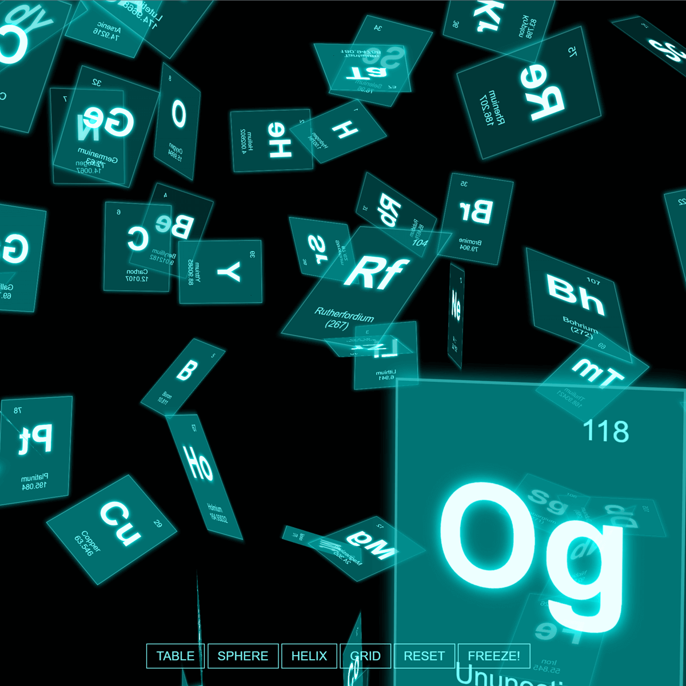

[original link with three.js ver59 dev](https://mrdoob.com/lab/javascript/threejs/css3d/periodictable/)

## More to add

click </a> to flip and change to a link

click to open La and Ac

## Problems with FOV reset

_this.object.position.addVectors is not a function

[This link is either outdated or not correct.](https://stackoverflow.com/questions/45252751/how-to-use-tween-to-animate-the-cameras-position)

